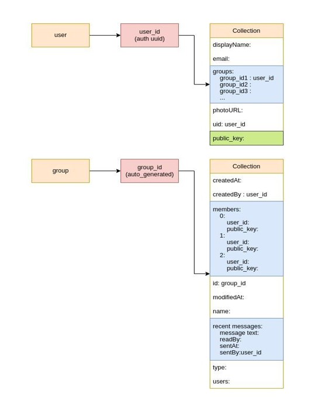
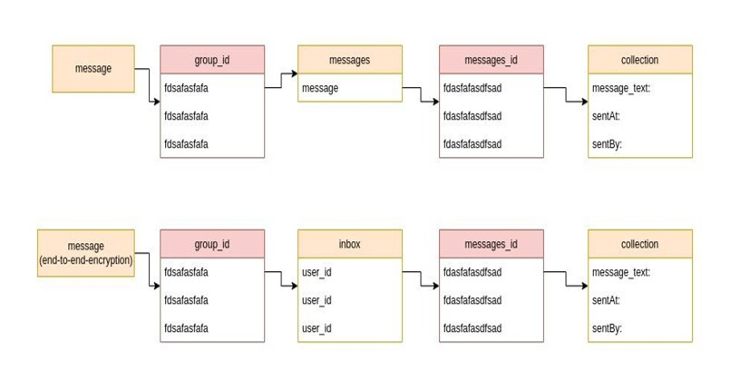

# link_chat_app

A new Flutter project to create a group based chat app with end to end encryption. This is a RSA encryption based chat app.
With this app you can communicate with anyone safely..Your private key can be removed from this app anytime if you feel threatened to make all your chats un readable..
Because of RSA generated key the massages in a group is encrypted and nobody can access that info from outside or in the database.

## Leave a star if U like it 😀
 

# Why are we calling this a Group based Chat app?

In this chat app we have gone with an approach that is based on groups. To start communicating with anyone in this chat app. Users have to first sign up in this app with their mobile number and then they can start the process.
They have to create a group first then add members to it. They have to use their phone number to add friends.
This group method is used for all one to one chat or one to many chats…
We have used firebase as our database and authentication.

# How many users can be in the same group?

There can be  7 users max in a group. Cause  the encrypted message limitations. If a user send message in 7 users group then the message will be 27 times in the database.

 

# Link Chat APP Screen shot 

## Splash screen

## Welcome screen

## Sign in page

## Sign up page

## Otp verification

## Homepage

## chat ui

## Adding friend

## Seeing active and connected people

## Settings page

## Profile screen

## Private key that can be modified in this page for security

## Privacy terms page

 

# Libraries that we have used in this chat app 

For encryption key download this library
- [FastRsa library] (https://pub.dev/packages/fast_rsa)  → Used

### dependencies:
``flutter:``
  * sdk: flutter
  
``The following adds the Cupertino Icons font to your application.
Use with the CupertinoIcons class for iOS style icons.``
  * cupertino_icons: ^1.0.2
  * cupertino_list_tile: ^0.2.1
  * For firestore…………..
  * cloud_firestore: ^3.4.6
  * firebase_auth: ^3.7.0
  * firebase_storage: ^10.3.7
  * firebase_core: ^1.21.1
  * cloud_functions: ^3.3.6

``For the pop up``
  * fluttertoast: ^8.0.9

``For encryption``
  * asn1lib: ^1.1.0
  * fast_rsa: ^3.4.7

``For saving private key in shared preferences``
  * flutter_secure_storage: ^6.0.0

``For flag``
  * intl_phone_field: ^3.1.0

``Timestamp``
  * intl: ^0.17.0

``for settings_ui``
  * flutter_settings_screens: ^0.3.0-null-safety

 

# For database Architecture 
## you can use this as a reference to make database for this app

## Getting Started with flutter

This project is a starting point for a Flutter application.

A few resources to get you started if this is your first Flutter project:

- [Lab: Write your first Flutter app](https://docs.flutter.dev/get-started/codelab)
- [Cookbook: Useful Flutter samples](https://docs.flutter.dev/cookbook)

For help getting started with Flutter development, view the
[online documentation](https://docs.flutter.dev/), which offers tutorials,
samples, guidance on mobile development, and a full API reference.

